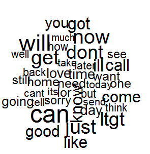
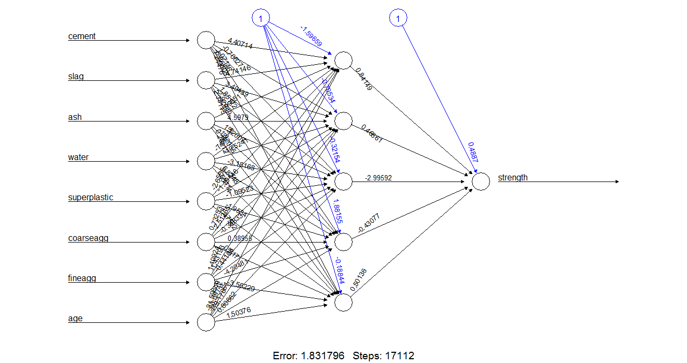

# Machine Learning with R

## [Supervised Learning Algorithms](#supervised-learning-algorithms)
* [Nearest Neighbor Classification](#nearest-neighbor-classification)
* [Naive Bayes Classification](#naive-bayes-classification)
* [Decision Trees Classification](#decision-trees-classification)
* [Linear Regression Numeric prediction](#linear-regression-numeric-prediction)
* [Regression Trees Numeric prediction](#regression-trees-numeric-prediction)
* [Neural Networks Dual use](#neural-networks-dual-use)
* [Support Vector Machines Dual use](#support-vector-machines-dual-use)

## Unsupervised Learning Algorithms
* [Association Rules Pattern detection](#association-rules-pattern-detection)
* [k-means clustering](#k-means-clustering)

## Meta-Learning Algorithms
* [Bagging Dual use]
* [Boosting Dual use]
* [Random Forests Dual use]

## Supervised Learning Algorithms
### [Nearest Neighbor Classification](https://github.com/kvinlazy/ML_R/blob/master/test_knn.R)

####  Nearest neighbor classifiers are defined by their characteristic of classifying unlabeled examples by assigning them the class of similar labeled examples. Despite the simplicity of this idea, nearest neighbor methods are extremely powerful.
<table>
  <tr>
    <th>Strengths</th>
    <th>Weaknesses</th>
  </tr>
  <tr>
    <td>Simple and effective</td>
    <td>Does not produce a model, limiting the ability to understand how the features are related to the class</td>
  </tr>
   <tr>
    <td> Makes no assumptions about the underlying data distribution</td>
    <td>Requires selection of an appropriate k</td>
  </tr>
  <tr>
    <td> Fast training phase</td>
    <td>Slow classification phase</td>
  </tr>
  <tr>
    <td> </td>
    <td>Nominal features and missing data require additional processing</td>
  </tr>
</table>

##### Diagnosing Breast Cancer
<table>
    <tr>
      <th></th>
      <th> wbcd_test_pred </th>
    </tr>
    <tr>
        <td>wbcd_test_labels</td>
        <td>Benign </td>
        <td>Malignant</td>
        <td>Row Total</td>
    </tr>
    <tr>
        <td>Benign</td>
        <td> 77 </td>
        <td>0</td>
        <td> 77</td>
    </tr>
    <tr>
        <td></td>
        <td> 1.000 </td>
        <td>0.000</td>
        <td> 0.770</td>
    </tr>
     <tr>
        <td></td>
        <td>  0.975 </td>
        <td>0.000</td>
        <td> </td>
    </tr>
     <tr>
        <td></td>
        <td>   0.770  </td>
        <td>0.000</td>
        <td> </td>
    </tr>
    <tr>
        <td>Malignant</td>
        <td>  2  </td>
        <td>21</td>
        <td>23 </td>
    </tr>
    <tr>
        <td></td>
        <td>  0.087 </td>
        <td>0.913</td>
        <td>0.230  </td>
    </tr>
    <tr>
        <td></td>
        <td> 0.025 </td>
        <td>1.000</td>
        <td>  </td>
    </tr>
    <tr>
        <td></td>
        <td>  0.020  </td>
        <td> 0.210</td>
        <td>  </td>
    </tr>
    <tr>
        <td>Column Total</td>
        <td>  79 </td>
        <td> 21</td>
        <td> 100  </td>
    </tr>
    <tr>
        <td></td>
        <td> 0.790  </td>
        <td> 0.210</td>
        <td>  0.210 </td>
    </tr>
  </table>

### [Naive Bayes Classification](https://github.com/kvinlazy/ML_R/blob/master/test.R)

#### The technique descended from the work of the 18th century mathematician Thomas Bayes, who developed foundational principles to describe the probability of events, and how probabilities should be revised in the light of additional information. These principles formed the foundation for what are now known as Bayesian methods.
<table>
  <tr>
    <th>Strengths</th>
    <th>Weaknesses</th>
  </tr>
  <tr>
    <td>Simple, fast, and very effective</td>
    <td>Relies on an often-faulty assumption of equally important and independent features</td>
  </tr>
  <tr>
    <td>Does well with noisy and missing data</td>
    <td>Not ideal for datasets with many numeric features</td>
    </tr>
  <tr>
    <td> Requires relatively few examples for training, but also works well with very large numbers of examples</td>
    <td>Estimated probabilities are less reliable than the predicted classes</td>
  </tr>
  <tr>
    <td>Easy to obtain the estimated probability for a prediction </td>
    <td></td>
    <tr>
      </table>
##### Filtering Mobile Phone Spam 

 

### [Decision Trees Classification](https://github.com/kvinlazy/ML_R/blob/master/test_c50.R)
### [Linear Regression Numeric prediction](https://github.com/kvinlazy/ML_R/blob/master/test_linear.R)
### [Regression Trees Numeric prediction](https://github.com/kvinlazy/ML_R/blob/master/test_cortree.R)
### [Neural Networks Dual use](https://github.com/kvinlazy/ML_R/blob/master/test_neutralnet.R)

### [Support Vector Machines Dual use](https://github.com/kvinlazy/ML_R/blob/master/test_OCR.R)

## Unsupervised Learning Algorithms
### [Association Rules Pattern detection](https://github.com/kvinlazy/ML_R/blob/master/test_aprori.R)
### [k-means clustering](https://github.com/kvinlazy/ML_R/blob/master/test_k.R)

## Meta-Learning Algorithms
### [Bagging Dual use]
### [Boosting Dual use]
### [Random Forests Dual use]

Reference: 
Machine Learning with R
Lantz, Brett. Machine learning with R. Packt Publishing Ltd, 2013.
